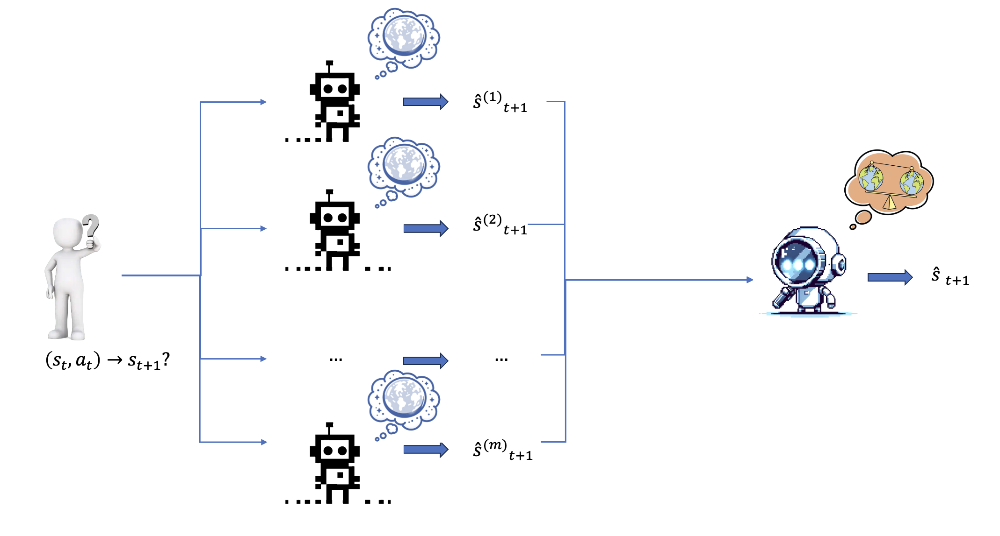

<p align="center">
    
</p>
<h2 align="center"> 🏭 DreamFactory:
Grounding Language Models to World
Model through Decentralized Generation
and Centralized Verification</h2>


We introduce DreamFactory, a step towards Text-Based World Models that:
1. 🌍 Simulates world states by leveraging the power of Large Language Models
2. 🧬 Combines decentralized generation and centralized verification

**For Details, Check Out [[Paper]](https://cloud.tsinghua.edu.cn/f/9611f6eef7114ff7b679/?dl=1)**


[[Paper]](https://cloud.tsinghua.edu.cn/f/9611f6eef7114ff7b679/?dl=1)
[[Code]](https://github.com/knightnemo/nlp-proj.)

<div align=center>

</div>

## News
- __[2024/12/22]__ Our observation of Self-Refutation hindering performance is supported by [[Understanding the Dark Side of LLMs' Intrinsic Self-Correction]](https://arxiv.org/abs/2412.14959) through extensive experiments, great work!
- __[2024/12/21]__ Release training and inference code.
- __[2024/12/21]__ Release the paper.

## Setup
Run the following Command:
```shell
conda create -n dreamfactory python=3.11.0 
conda activate pandora
pip install -r
```
## API key
This project supports OPENAI API key, third-party API providers(together api) and local downloaded language models.

Example:
```shell
cd text-simulator
```
Local downloaded language models:
```shell
# For local models (Mistral-7B-v0.1 for example)
CUDA_VISIBLE_DEVICES=0 python experiments/quest_llama.py --model_path "mistralai/Mistral-7B-v0.1" --model_type local --output_prefix mistral_hwr_diff_full --device cuda --rule_folder ./rules/human_written_rules --output_folder results --data_type full --partial
```
Third-party API providers(together api)
```shell
# For third-party api providers
CUDA_VISIBLE_DEVICES=1 python experiments/quest_llama.py --model_path "meta-llama/Meta-Llama-3.1-405B-Instruct-Turbo" --model_type together --output_prefix llama3_405b_hwr_diff_full --device cuda --rule_folder ./rules/human_written_rules --output_folder results --data_type full --partial
```
## Contact
Please contact us or post an issue if you have any questions (as a course project, we do expect to encounter some questions lol).

📬 Siqiao Huang (huang-sq23,chengpy23,guojh23@mails.tsinghua.edu.cn)

📬 Pingyue Sheng (chengpy23@mails.tsinghua.edu.cn)

📬 Jiahe Guo (guojh23@mails.tsinghua.edu.cn)
## Acknowledgement
The `text-simulator` part of this codebase is based on the implementation from [Can Language Models Serve as Text-Based World Simulators?](https://arxiv.org/abs/2406.06485).
